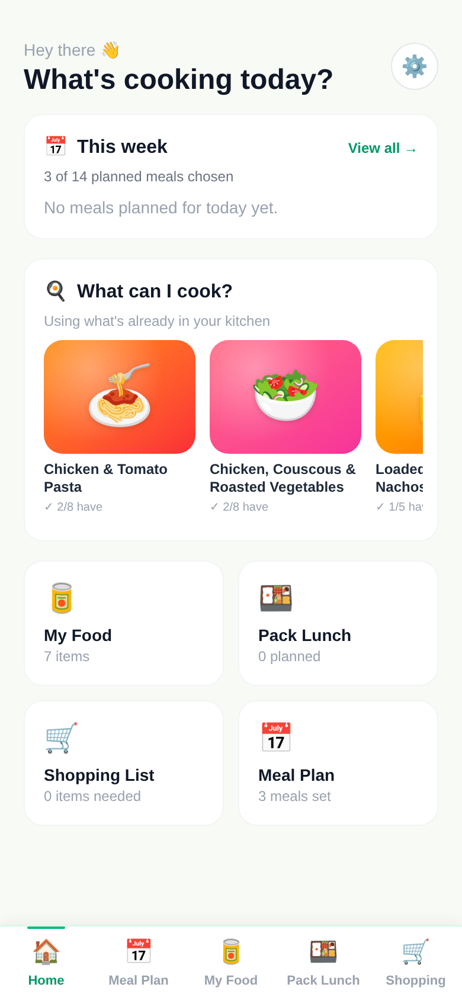
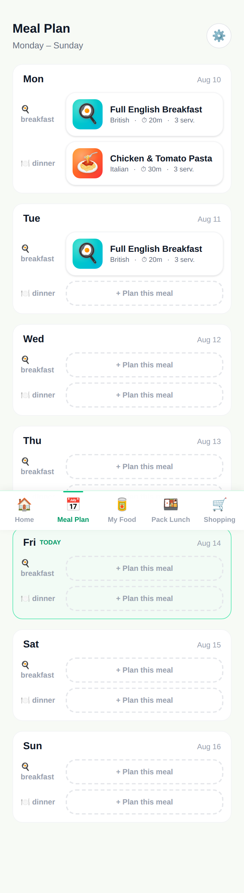
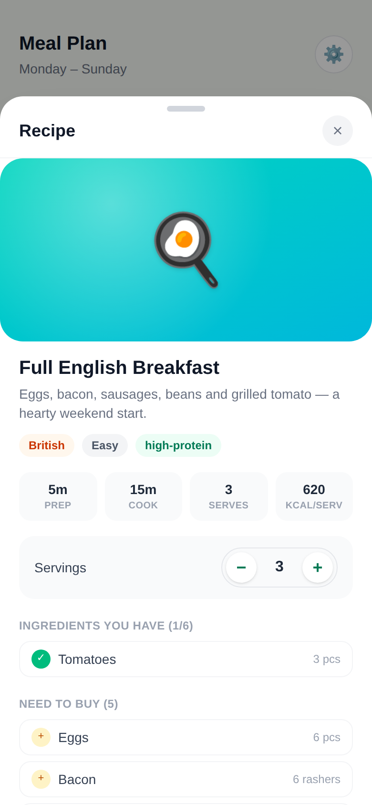
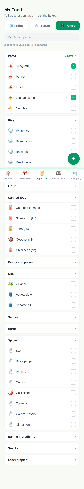
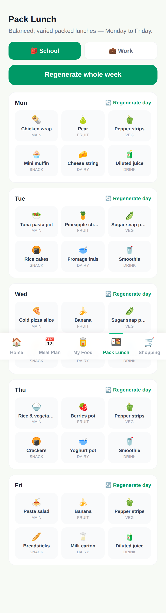
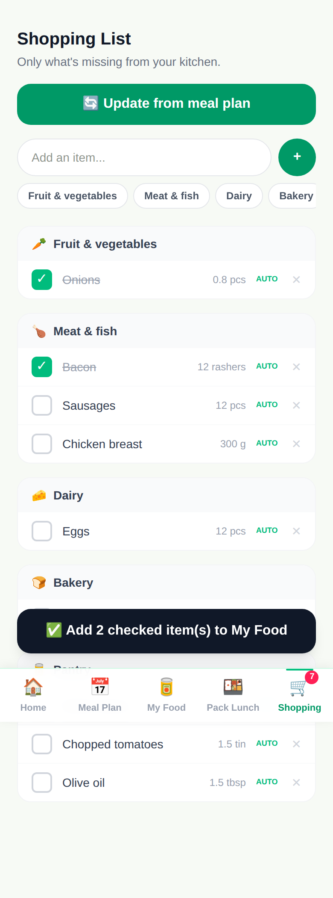

# PantryPal — Smart Pantry & Meal Planning App

A polished, mobile-first React + TypeScript template for a meal-planning app with a genuine hook: **it plans meals around the food the user already has**, rather than generating recipes and leaving them to go shopping for everything.

> Tell us what food you have → set household & dietary preferences → generate meals → choose one → reserve ingredients → auto-build a missing-items shopping list → cook → inventory updates itself.

Built as a production-quality **starting point** — clean architecture, no dead code, fully typed, zero console errors — for anyone who wants to launch a meal-planning product without starting from a blank repo.

<p align="center">
  
  
  
</p>
<p align="center">
  
  
  
</p>

## What's included

- **Onboarding** — household size, children with ages, dietary preferences, allergies, disliked ingredients, cuisine preferences, meal styles, typical servings. Fully editable afterward from a Preferences screen.
- **My Food** — a ~150-item searchable pantry/fridge/freezer catalog with one-tap "I have this" checklists, custom items, quantities and expiry dates. Categorised, fast to fill in.
- **Meal Plan** — a Monday–Sunday planner. Pick which meals to plan (breakfast/lunch/dinner/snack), who's eating, and a meal style (quick, family, healthy, budget, use leftovers, use-what's-expiring, etc). Every slot generates 2–3 recipe options, scored and ranked by what's already on hand, with **already have** vs **need to buy** shown per ingredient.
- **Recipe engine** — a self-contained scoring/filtering engine (`src/utils/mealGenerator.ts`) that respects diet restrictions, allergies, dislikes, cuisine preference, cook-time limits and ingredient availability — no external API required. Ships with 51 fully-written recipes across 13 cuisines.
- **Recipe detail** — large hero image (emoji + gradient tile, no stock photo licensing to worry about), scaled ingredient quantities, step-by-step method, nutrition, allergens, substitutions, and a **"Cook this meal"** action that deducts tracked pantry quantities.
- **Pack Lunch** — Monday–Friday packed lunches for kids (main/fruit/veg/snack/dairy/drink, deliberately varied across the week) and portable lunches for adults by style (quick/healthy/high-protein/leftovers/meal-prep/no-reheat).
- **Shopping List** — auto-built from the week's plan, showing only what's actually missing, grouped by category. Manual add/remove/check-off, with a one-tap "add purchased items back into My Food."
- **Full i18n** — English and Italian out of the box (`src/i18n/`), covering every UI string, all 51 recipes, the ~200-item ingredient catalog, and every enum label (diets, cuisines, allergens, units, days). Adding a third language means adding one more dictionary file, not touching component code.
- **PWA-ready** — installable, offline-capable via `vite-plugin-pwa`.

## Tech stack

React 19 · TypeScript · Vite · Tailwind CSS v4 · no backend, no API keys, no paid services required to run it. All state lives in `localStorage` via a single store hook (`src/store.ts`), with data models already shaped for the natural next steps (see [Growth roadmap](#growth-roadmap-what-this-is-built-to-become) below).

## Quick start

```bash
npm install
npm run dev       # dev server with hot reload
npm run build     # type-check + production build → dist/
npm run preview   # serve the production build locally
npm run lint       # oxlint
```

Requires Node 18+.

## Deploying it

`dist/` after `npm run build` is a fully static site — deploy it anywhere that serves static files:

- **GitHub Pages**: point Pages at a `dist` build (see `.github/workflows` for a ready-made Actions workflow), or build once and upload `dist/index.html` directly to a repo configured for Pages.
- **Netlify / Vercel / Cloudflare Pages**: connect the repo, build command `npm run build`, publish directory `dist`.
- **Any static host / S3 / your own server**: just upload the contents of `dist/`.

## Making it yours

This is meant to be re-skinned, not used as-is:

- **Name & branding** — update `<title>` in `index.html`, `name`/`short_name`/theme colours in the PWA manifest block of `vite.config.ts`, and the favicon/icon files in `public/`.
- **Colour palette** — the whole UI runs on Tailwind utility classes centred on `emerald-*`; a find-and-replace of the accent colour class is most of the work.
- **Recipes & ingredients** — everything lives in plain, readable data files: `src/data/recipes.ts`, `src/data/ingredients.ts`, `src/data/lunchbox.ts`. Adding a recipe is adding one object to an array; no schema migration needed.
- **Languages** — add a new key to `src/i18n/strings.ts`/`labels.ts`/`foodNames.ts`/`recipeText.ts` per string, and a language toggle option in `Onboarding.tsx`/`Settings.tsx`.
- **New sections** — the five-tab navigation (`src/components/Nav.tsx`) and page-per-tab structure (`src/pages/`) make it straightforward to add another top-level section.

## Growth roadmap (what this is built to become)

The data model and store are deliberately shaped to support real product growth without a rewrite:

- **Accounts + cloud sync** — swap the `localStorage`-backed store hook for a real backend (Supabase/Firebase/your own API); the shape of `HouseholdPreferences`, `PantryItem`, `WeekPlan` etc. (`src/types.ts`) already matches what a normalized database schema would need.
- **AI-generated recipes** — `src/utils/mealGenerator.ts` is the single seam where recipe suggestions come from; replacing the static 51-recipe pool with a call to an LLM (or a recipe API) touches one file.
- **Barcode / receipt scanning, photo ingredient recognition** — natural extensions of the "My Food" add-item flow, which is already a single well-isolated component (`src/pages/MyFood.tsx`).
- **Nutrition tracking, grocery delivery integrations, subscriptions/payments** — additive features on top of the existing recipe/shopping-list data, not architectural changes.

## License

See [`LICENSE.md`](LICENSE.md).

## Project history

See [`CHANGELOG.md`](CHANGELOG.md).
