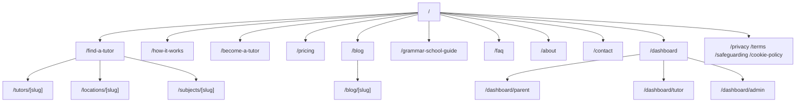

# Information Architecture & Wireframe Descriptions

## Sitemap

## Page inventory

| Route | Type | Purpose |
|---|---|---|
| `/` | Static (SSG) | Primary conversion page: hero, search, trust signals, featured tutors, FAQ, CTA |
| `/about` | Static | Company story, mission, values |
| `/how-it-works` | Static | Full parent + tutor journey explanation |
| `/find-a-tutor` | Dynamic (search) | Filterable tutor directory |
| `/tutors/[slug]` | SSG (generateStaticParams) | Individual tutor profile + booking |
| `/become-a-tutor` | Static | Tutor recruitment landing page |
| `/pricing` | Static | Parent and tutor pricing |
| `/blog`, `/blog/[slug]` | SSG | SEO content hub |
| `/grammar-school-guide` | Static | High-intent SEO/education content, top-of-funnel |
| `/faq` | Static | Categorised FAQ |
| `/contact` | Static | Contact form, routed by inquiry type |
| `/locations/[slug]` | SSG | Local SEO landing pages (Aylesbury, High Wycombe, Milton Keynes, Buckingham, Online) |
| `/subjects/[slug]` | SSG | Subject SEO landing pages (Maths, English, Verbal/Non-Verbal Reasoning, etc.) |
| `/dashboard` | Static | Role picker (temporary, pre-auth) |
| `/dashboard/parent` | Protected | Parent home: bookings, payments, progress, homework |
| `/dashboard/tutor` | Protected | Tutor home: calendar, bookings, earnings, reviews |
| `/dashboard/admin` | Protected | Admin home: approvals, disputes, revenue, support |
| `/privacy`, `/terms`, `/safeguarding`, `/cookie-policy` | Static | Legal/compliance |
| `/404` | Static | Not found |

## Wireframe descriptions

### Homepage
1. **Nav** — logo, primary links, Log in, gold "Get Matched" CTA button, sticky on scroll.
2. **Hero** — two columns: left = headline + subhead + dual CTA + trust strip
   (rating, DBS badge); right = inline subject/location search card + "250+
   vetted tutors" social proof strip with stacked avatars.
3. **Benefits** — 4-card grid, icon-less (typographic), one differentiator each.
4. **How it works** — 4-step numbered list, large ghost numerals, gold accents.
5. **Featured tutors** — 3-card grid using the tutor card component.
6. **Stats band** — full-width navy strip, 4 stat columns.
7. **Subjects** — grid of subject link-cards, category label + description.
8. **Grammar School Guide teaser** — 2-column: copy + CTA left, key-dates
   info-cards right.
9. **Reviews** — 2-column testimonial cards with star rating.
10. **FAQ** — accordion, top 5 questions, link to full FAQ page.
11. **CTA band** — full-width navy strip, centered headline + dual CTA.
12. **Footer** — 5-column link structure (brand, Platform, Resources, Locations,
    Company) + legal row.

### Find a Tutor
Two-column layout: sticky filter sidebar (subject, location, lesson type,
max price) on the left (280px), responsive results grid (2–3 columns) on the
right. Empty state with reassurance copy when no matches.

### Tutor Profile
Header band: avatar, name, verification badges, rating/review count, location,
mode, rate, "Save tutor" button. Two-column body: main column (video intro
placeholder, bio, subjects, qualifications, at-a-glance stats, availability);
sticky sidebar with free-consultation booking form.

### Parent / Tutor / Admin Dashboards
Fixed dark sidebar (role label, nav, user chip) + top bar (page title,
notification bell, avatar) + content area using a stat-card row followed by
a 2–3 column widget grid (tables, lists, progress bars). Same shell component
reused across all three roles with role-specific nav items and widgets.

## Navigation rules

- Primary nav is subject/location agnostic; SEO landing pages are reached via
  footer, sitemap.xml, and internal links from the homepage subject grid — not
  the primary nav, to keep it uncluttered.
- Dashboard routes intentionally omit the marketing navbar/footer (separate
  shell) and are excluded from the sitemap and marked `noindex`.
