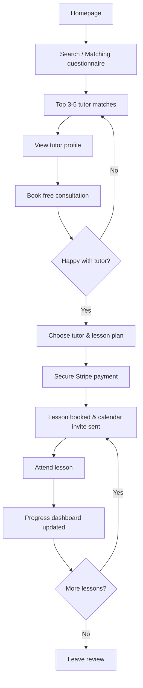
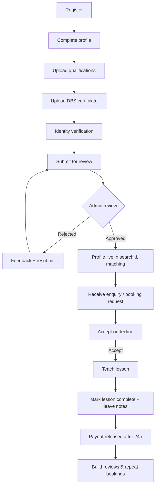
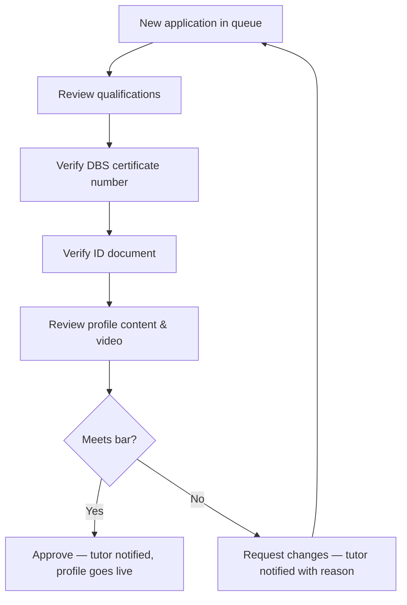
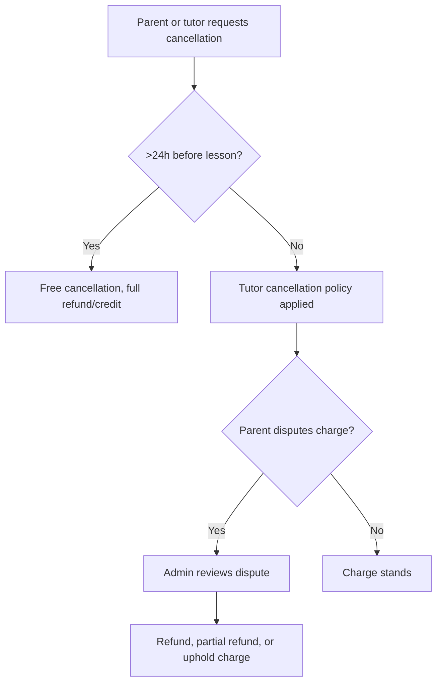

# User Flows

## Parent journey

**Key decision points & requirements:**
- After step B, the matching algorithm (see [Matching Algorithm](./07-matching-algorithm.md))
  must return results in under 2 seconds.
- Step E (free consultation) is mandatory before first paid booking — enforced in
  the booking flow, not just suggested.
- Step H must support recurring bookings (weekly recurring lesson) as well as
  one-off, with the ability to cancel/reschedule with a 24-hour policy.
- Step K progress updates come from the tutor after each lesson (lesson note +
  optional score); this is the retention-driving loop.

## Tutor journey

**Key decision points & requirements:**
- Step F→G: admin review SLA target is 3 business days; tutor sees a status
  tracker (Submitted → In review → Approved/Changes requested).
- Step D/E cannot be skipped — a tutor cannot reach "submit for review" without
  both an uploaded DBS certificate and verified ID.
- Step N payout: Stripe Connect Express account required before a tutor can
  accept paid bookings (can still do the free consultation without it).

## Admin journey (tutor approval)

## Booking cancellation / dispute flow

