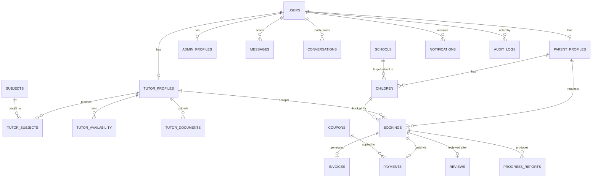

# Database Schema

Target: PostgreSQL via Supabase. UUID primary keys, `timestamptz` throughout,
Row Level Security (RLS) enabled on every user-facing table (policies summarised
at the bottom). This schema is designed but not yet migrated in this repo — no
Supabase project is connected in the current MVP frontend.

## Entity relationship overview



## DDL

```sql
-- Extensions
create extension if not exists "uuid-ossp";
create extension if not exists "pgcrypto";

-- ============================================================
-- CORE IDENTITY
-- ============================================================

create type user_role as enum ('parent', 'tutor', 'admin');
create type verification_status as enum ('pending', 'in_review', 'approved', 'rejected');

create table users (
  id uuid primary key default gen_random_uuid(),
  auth_user_id uuid unique not null,          -- references Supabase auth.users(id)
  email text unique not null,
  phone text,
  role user_role not null,
  full_name text not null,
  avatar_url text,
  is_active boolean not null default true,
  created_at timestamptz not null default now(),
  updated_at timestamptz not null default now()
);

create table parent_profiles (
  user_id uuid primary key references users(id) on delete cascade,
  address_line1 text,
  address_line2 text,
  city text,
  postcode text,
  county text default 'Buckinghamshire',
  marketing_opt_in boolean not null default false,
  stripe_customer_id text,
  created_at timestamptz not null default now()
);

create table schools (
  id uuid primary key default gen_random_uuid(),
  name text not null,
  town text not null,
  county text not null default 'Buckinghamshire',
  school_type text not null default 'grammar', -- grammar | independent | consortium
  test_format text,                        -- CSSE | GL | CEM | ISEB
  website_url text,
  created_at timestamptz not null default now()
);

create table children (
  id uuid primary key default gen_random_uuid(),
  parent_id uuid not null references parent_profiles(user_id) on delete cascade,
  first_name text not null,
  year_group text not null,               -- e.g. 'Year 4', 'Year 5', 'Year 6'
  date_of_birth date,
  target_school_id uuid references schools(id),
  learning_needs text,                     -- free text: SEN notes, if any
  notes text,
  created_at timestamptz not null default now()
);

-- ============================================================
-- TUTORS
-- ============================================================

create table tutor_profiles (
  user_id uuid primary key references users(id) on delete cascade,
  slug text unique not null,
  tagline text,
  bio text,
  hourly_rate_pence integer not null,
  currency text not null default 'GBP',
  years_experience integer not null default 0,
  location_text text,
  latitude numeric(9,6),
  longitude numeric(9,6),
  travel_radius_km integer default 0,
  lesson_mode text not null default 'online_and_in_person', -- online | in_person | online_and_in_person
  languages text[] not null default array['English'],
  video_intro_url text,
  verification_status verification_status not null default 'pending',
  dbs_verified boolean not null default false,
  dbs_certificate_number text,
  dbs_issue_date date,
  id_verified boolean not null default false,
  is_listed boolean not null default false,   -- only true once approved
  is_featured boolean not null default false,
  stripe_connect_account_id text,
  response_time_minutes integer,
  average_rating numeric(3,2) default 0,
  review_count integer not null default 0,
  lessons_completed integer not null default 0,
  cancellation_policy text default '24_hours',
  created_at timestamptz not null default now(),
  updated_at timestamptz not null default now()
);

create table subjects (
  id uuid primary key default gen_random_uuid(),
  slug text unique not null,
  name text not null,
  category text not null,   -- 11+ | Core | GCSE | A-Level | SEN
  description text
);

create table tutor_subjects (
  tutor_id uuid not null references tutor_profiles(user_id) on delete cascade,
  subject_id uuid not null references subjects(id) on delete cascade,
  level text,               -- e.g. '11+', 'GCSE', 'A-Level'
  primary key (tutor_id, subject_id)
);

create type document_type as enum ('dbs_certificate', 'id_document', 'qualification', 'other');
create type document_status as enum ('pending', 'verified', 'rejected');

create table tutor_documents (
  id uuid primary key default gen_random_uuid(),
  tutor_id uuid not null references tutor_profiles(user_id) on delete cascade,
  document_type document_type not null,
  storage_path text not null,      -- Supabase Storage object path
  status document_status not null default 'pending',
  reviewed_by uuid references users(id),
  reviewed_at timestamptz,
  rejection_reason text,
  uploaded_at timestamptz not null default now()
);

create table tutor_qualifications (
  id uuid primary key default gen_random_uuid(),
  tutor_id uuid not null references tutor_profiles(user_id) on delete cascade,
  title text not null,
  institution text,
  year_awarded integer,
  document_id uuid references tutor_documents(id)
);

create table tutor_availability (
  id uuid primary key default gen_random_uuid(),
  tutor_id uuid not null references tutor_profiles(user_id) on delete cascade,
  day_of_week smallint not null check (day_of_week between 0 and 6),
  start_time time not null,
  end_time time not null,
  is_recurring boolean not null default true
);

-- ============================================================
-- ADMIN
-- ============================================================

create table admin_profiles (
  user_id uuid primary key references users(id) on delete cascade,
  permissions text[] not null default array['tutor_review'],
  created_at timestamptz not null default now()
);

-- ============================================================
-- BOOKINGS, PAYMENTS, INVOICES
-- ============================================================

create type booking_status as enum (
  'requested', 'consultation_scheduled', 'confirmed', 'completed',
  'cancelled_by_parent', 'cancelled_by_tutor', 'no_show', 'disputed'
);
create type lesson_type as enum ('consultation', 'lesson');

create table bookings (
  id uuid primary key default gen_random_uuid(),
  parent_id uuid not null references parent_profiles(user_id),
  tutor_id uuid not null references tutor_profiles(user_id),
  child_id uuid references children(id),
  subject_id uuid references subjects(id),
  lesson_type lesson_type not null default 'lesson',
  status booking_status not null default 'requested',
  scheduled_start timestamptz not null,
  scheduled_end timestamptz not null,
  is_recurring boolean not null default false,
  recurrence_rule text,                 -- iCal RRULE if recurring
  meeting_url text,                     -- Google Meet link for online lessons
  price_pence integer,
  cancelled_at timestamptz,
  cancelled_reason text,
  created_at timestamptz not null default now(),
  updated_at timestamptz not null default now()
);

create type payment_status as enum ('pending', 'authorized', 'captured', 'refunded', 'partially_refunded', 'failed');

create table coupons (
  id uuid primary key default gen_random_uuid(),
  code text unique not null,
  discount_type text not null,          -- 'percent' | 'fixed'
  discount_value integer not null,
  max_redemptions integer,
  redeemed_count integer not null default 0,
  expires_at timestamptz,
  created_at timestamptz not null default now()
);

create table payments (
  id uuid primary key default gen_random_uuid(),
  booking_id uuid not null references bookings(id),
  parent_id uuid not null references parent_profiles(user_id),
  amount_pence integer not null,
  platform_fee_pence integer not null,
  tutor_payout_pence integer not null,
  currency text not null default 'GBP',
  status payment_status not null default 'pending',
  stripe_payment_intent_id text unique,
  coupon_id uuid references coupons(id),
  captured_at timestamptz,
  released_to_tutor_at timestamptz,     -- 24h after lesson completion
  created_at timestamptz not null default now()
);

create table invoices (
  id uuid primary key default gen_random_uuid(),
  payment_id uuid not null references payments(id),
  parent_id uuid not null references parent_profiles(user_id),
  invoice_number text unique not null,
  pdf_storage_path text,
  issued_at timestamptz not null default now()
);

-- ============================================================
-- REVIEWS, PROGRESS, MESSAGING
-- ============================================================

create table reviews (
  id uuid primary key default gen_random_uuid(),
  booking_id uuid unique not null references bookings(id),
  parent_id uuid not null references parent_profiles(user_id),
  tutor_id uuid not null references tutor_profiles(user_id),
  rating smallint not null check (rating between 1 and 5),
  comment text,
  is_published boolean not null default true,
  created_at timestamptz not null default now()
);

create table progress_reports (
  id uuid primary key default gen_random_uuid(),
  booking_id uuid not null references bookings(id),
  child_id uuid not null references children(id),
  tutor_id uuid not null references tutor_profiles(user_id),
  summary text not null,
  mock_score numeric(5,2),
  homework_set text,
  created_at timestamptz not null default now()
);

create table conversations (
  id uuid primary key default gen_random_uuid(),
  parent_id uuid not null references parent_profiles(user_id),
  tutor_id uuid not null references tutor_profiles(user_id),
  booking_id uuid references bookings(id),
  created_at timestamptz not null default now(),
  unique (parent_id, tutor_id)
);

create table messages (
  id uuid primary key default gen_random_uuid(),
  conversation_id uuid not null references conversations(id) on delete cascade,
  sender_id uuid not null references users(id),
  body text not null,
  read_at timestamptz,
  created_at timestamptz not null default now()
);

-- ============================================================
-- NOTIFICATIONS, AUDIT
-- ============================================================

create table notifications (
  id uuid primary key default gen_random_uuid(),
  user_id uuid not null references users(id) on delete cascade,
  type text not null,                   -- booking_confirmed | payout_released | document_rejected | ...
  title text not null,
  body text,
  is_read boolean not null default false,
  created_at timestamptz not null default now()
);

create table audit_logs (
  id uuid primary key default gen_random_uuid(),
  actor_id uuid references users(id),
  action text not null,                 -- e.g. 'tutor.approved', 'payment.refunded'
  entity_type text not null,
  entity_id uuid,
  metadata jsonb,
  created_at timestamptz not null default now()
);

-- ============================================================
-- INDEXES
-- ============================================================

create index idx_tutor_profiles_listed on tutor_profiles (is_listed) where is_listed = true;
create index idx_tutor_subjects_subject on tutor_subjects (subject_id);
create index idx_bookings_tutor_start on bookings (tutor_id, scheduled_start);
create index idx_bookings_parent_start on bookings (parent_id, scheduled_start);
create index idx_messages_conversation on messages (conversation_id, created_at);
create index idx_notifications_user_unread on notifications (user_id) where is_read = false;
```

## Row Level Security (summary)

All tables carry RLS policies enforcing:
- A `parent` can only read/write their own `parent_profiles`, `children`,
  `bookings`, `payments`, `messages` rows (matched via `auth.uid()` → `users.auth_user_id`).
- A `tutor` can read/write their own `tutor_profiles` row and any booking/message
  where they are the counterparty; they can only read `parent_profiles`/`children`
  fields relevant to an active booking (not arbitrary parent data).
- `admin` role bypasses per-user restrictions via a dedicated `service_role`-backed
  policy, used only from server-side admin routes — never exposed to the browser.
- `subjects` and `schools` are public-read, admin-write.
- `reviews` are public-read (published only), write-restricted to the parent who
  completed the associated booking.

## Notes on scaling beyond MVP

- `tutor_profiles.location_text` + lat/long is sufficient for MVP proximity
  sorting; a PostGIS `geography` column should replace raw lat/long once
  radius search volume justifies it.
- `progress_reports.mock_score` is deliberately loose (`numeric`) in MVP; a
  dedicated `mock_exams` + `mock_exam_results` table pair is planned for the
  Mock Exams product (Phase 2).
