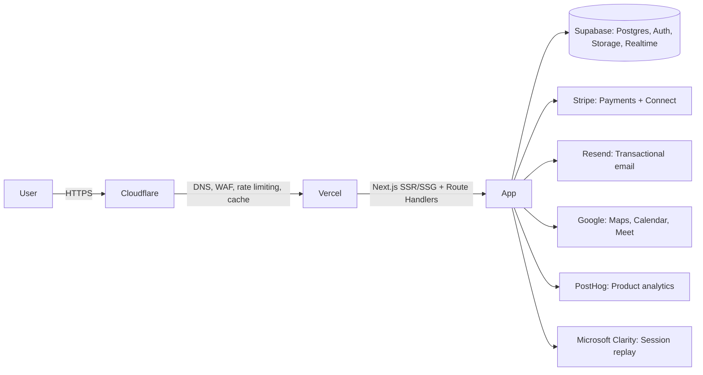

# Deployment Guide

## Infrastructure overview

## Environments

| Environment | Purpose | Deploy trigger |
|---|---|---|
| Local | Development | `npm run dev`, Supabase CLI local stack |
| Preview | Per-PR review + automated E2E | Every PR → Vercel Preview Deployment |
| Staging | Pre-release soak testing, demoing to stakeholders | Merge to `main` |
| Production | Live site | Manual promotion of a verified staging build |

## Vercel configuration

- Framework preset: Next.js (App Router)
- Node runtime for Route Handlers that touch Stripe/Supabase service role
  (avoid Edge runtime where secrets/service-role access is required)
- Environment variables scoped per environment (Preview/Staging/Production get
  different Stripe/Supabase keys — **never** share live Stripe keys into
  Preview/Staging)
- `NEXT_PUBLIC_*` variables limited strictly to values safe for client exposure
  (e.g. Supabase anon key, PostHog public key) — service role keys and Stripe
  secret keys are server-only

## Cloudflare configuration

- DNS proxied through Cloudflare (orange-clouded) in front of Vercel
- WAF rules: OWASP core ruleset enabled, bot-fight mode for auth/payment routes
- Rate limiting rules matching the API limits in
  [API Specification](./06-api-specification.md)
- Cache rules: static assets and SSG pages cached aggressively; `/api/*` and
  `/dashboard/*` set to bypass cache

## Database migrations

- Supabase CLI migrations checked into the repo (`supabase/migrations/`),
  applied via CI on merge to `main` against staging, then manually promoted to
  production after verification — schema changes never applied by hand against
  production.
- Every migration is additive/backwards-compatible where possible (add-column,
  not rename-in-place) to avoid downtime; destructive migrations follow a
  documented expand-migrate-contract pattern.

## Release process

1. PR merges to `main` after CI is green (see [Testing Plan](./14-testing-plan.md))
2. Automatic deploy to Staging + migration apply
3. Automated E2E suite runs against Staging
4. Manual smoke test of the critical-path scenarios
5. Manual promotion to Production via Vercel's promote-deployment flow (same
   build artifact as Staging — no rebuild, eliminating "works in staging,
   broke in prod build" class of issues)
6. Post-deploy: automated health check hits key routes + Stripe webhook
   liveness; error-rate dashboard watched for 30 minutes

## Rollback

- Vercel instant rollback to the previous production deployment (build
  artifact retained) for any frontend/app-layer issue
- Database migrations design for backwards compatibility specifically so a
  frontend rollback never requires a corresponding destructive DB rollback
- Stripe/webhook issues: idempotency keys on all payment-mutating operations so
  a retry after rollback cannot double-charge or double-payout

## Secrets & config management

- All secrets stored in Vercel's encrypted environment variable store, scoped
  per environment, rotated on a documented schedule (Stripe/Supabase keys at
  minimum annually or immediately on suspected compromise)
- No secret ever committed to the repo; `.env.local` is git-ignored and used
  only for local development against local/dev services

## Monitoring & alerting

- Vercel Analytics + Speed Insights for real-user Core Web Vitals
- Error tracking (Sentry or equivalent) wired into both client and server
  boundaries, alerting on error-rate spikes
- Stripe Dashboard + webhook delivery monitoring for payment-path health
- Supabase dashboard for database performance/connection-pool monitoring
- Uptime monitoring (e.g. a simple external pinger) against the production
  homepage and a synthetic booking-flow health check endpoint
